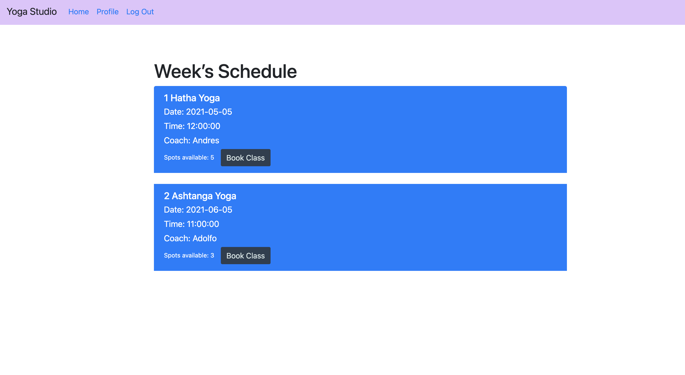
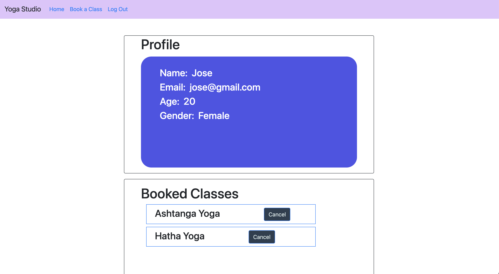

# yoga-studio

[![MIT License][license-shield]][license-url]

## Description

We want to provide yogis with an easy and accesible application for searching and reserving yoga classes, create an account in the Yoga Studio portal, see available slots in classes as well as visualize client profile and scheduled sessions and coaches.

## Table of Contents
- [About the Project](#installation)
- [Built With](#installation)
- [Installation](#installation)
- [Usage](#usage)
- [Credits and Contact](#credits_and_Contact)
- [License](#license)

<!-- ABOUT THE PROJECT -->
## About The Project


## Built With

* []() MySQL - [MySQL - The world's most popular open source database](mysql.com)
* []() Sequelize [Promise-based Node.js ORM for Postgres, MySQL, MariaDB, SQLite and Microsoft SQL Server.](https://sequelize.org/)
* []() Axios [Promise based HTTP client for the browser and node.js](https://www.npmjs.com/package/axios)
* []() Bcrypt [A NPM library to help you hash passwords.](https://www.npmjs.com/package/bcrypt)
* []() ESLint [Static code analysis tool for identifying problematic patterns found in JavaScript code](https://eslint.org/)


<!-- GETTING STARTED -->
## Getting Started

To get a local copy up and running follow these simple steps.

### Prerequisites

1. Clone the repo
   ```sh
   git clone https://github.com/Enrique246/yoga-project 
   ```

### Installation


1. Install NPM packages
   ```sh
   npm install
   ```

2. Start yoga-project application
   ```sh
   npm start
   ```


<!-- USAGE EXAMPLES -->
## Usage
* To create an account or login, just click on Log In link and fill the required fields.


* To book a class, click on Book a Class link on nav bar, find your desired class and click on Book Now button!


 * You can review your profile and your scheduled classes in Profile tab, just remember to be already signed up and loged in. 



<!-- LICENSE -->
## License

Distributed under the MIT License. See `LICENSE` for more information.


<!-- CONTACT -->
## Credits and Contact

- Miranda Ramirez - [@GitHub](https://github.com/Mirandarmz) - email: (mailto:fake_miranda@mail.com)
- Enrique del Castillo - [@GitHub](https://github.com/Enrique246) - email: (mailto:fake_enrique@mail.com)
- Andres Borja - [@GitHub](https://twitter.com/twitter_handle) - email: (mailto:fake_andres@mail.com)
- Adolfo de Moure - [@GitHub](https://github.com/ANDRESPLASENCIABORJA) - email: (mailto:fake_adolfo@mail.com)

Project Link: [https://github.com/Enrique246/yoga-project](https://github.com/Enrique246/yoga-project)


<!-- ACKNOWLEDGEMENTS -->
## Acknowledgements

* []() Marco Montero - Bootcamp Teacher Assistant 👏🏼👏🏼
* []() Tyler Wright - Bootcamp Class Instructor 👨🏻‍🏫👨🏻‍🏫
* []() ITESM and Trilogy Education Services 📚📚


<!-- MARKDOWN LINKS & IMAGES -->
<!-- https://www.markdownguide.org/basic-syntax/#reference-style-links -->
[contributors-shield]: https://img.shields.io/github/contributors/github_username/repo.svg?style=for-the-badge
[contributors-url]: https://github.com/github_username/repo/graphs/contributors
[forks-shield]: https://img.shields.io/github/forks/github_username/repo.svg?style=for-the-badge
[forks-url]: https://github.com/github_username/repo/network/members
[stars-shield]: https://img.shields.io/github/stars/github_username/repo.svg?style=for-the-badge
[stars-url]: https://github.com/github_username/repo/stargazers
[issues-shield]: https://img.shields.io/github/issues/github_username/repo.svg?style=for-the-badge
[issues-url]: https://github.com/github_username/repo/issues
[license-shield]: https://img.shields.io/github/license/github_username/repo.svg?style=for-the-badge
[license-url]: https://github.com/github_username/repo/blob/master/LICENSE.txt
[linkedin-shield]: https://img.shields.io/badge/-LinkedIn-black.svg?style=for-the-badge&logo=linkedin&colorB=555
[linkedin-url]: https://linkedin.com/in/github_username

